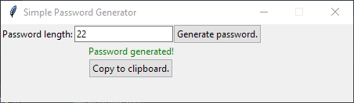

# SimplePasswordGenerator
A simple app to generate random passwords.
## Usage
When you run the program you will see a screen that looks something like this:  
  
The password length can be changed to whatever you want, 22 is the default.

Clicking `Generate password` will generate a password, which you can copy to your clipboard by clicking the `Copy to clipboard` button.
  

## License
[MIT](https://choosealicense.com/licenses/mit/)
